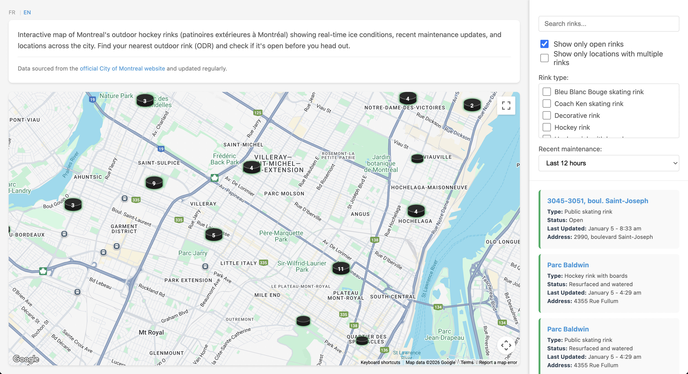

# Patinoires Montréal / Montreal Outdoor Rinks

An interactive map of outdoor skating rinks in Montreal, showing real-time status and conditions. The data is sourced from the [official City of Montreal website](https://montreal.ca/en/outdoor-skating-rinks-conditions) and updated regularly.

## Features

- 🗺️ Interactive map with all outdoor rinks in Montreal
- 🟢 Real-time status indicators (open/closed)
- 🌐 Bilingual support (French/English)
- 📱 Mobile-responsive design
- 🔍 Search and filter functionality

## Live Site

Visit [patinoiresmtl.ca](https://www.patinoiresmtl.ca)

